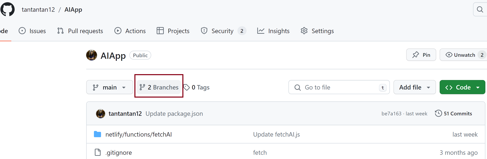
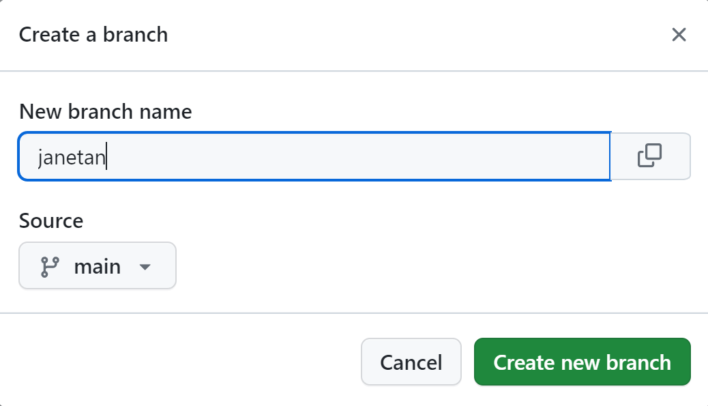
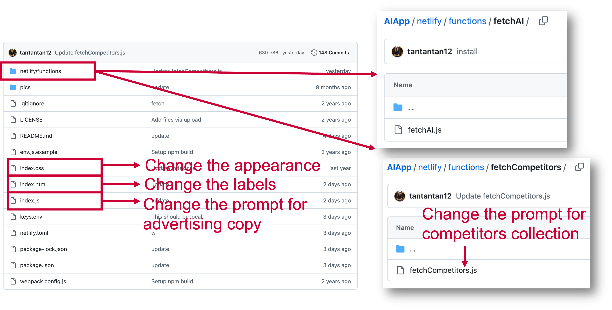
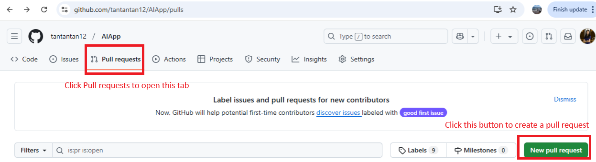
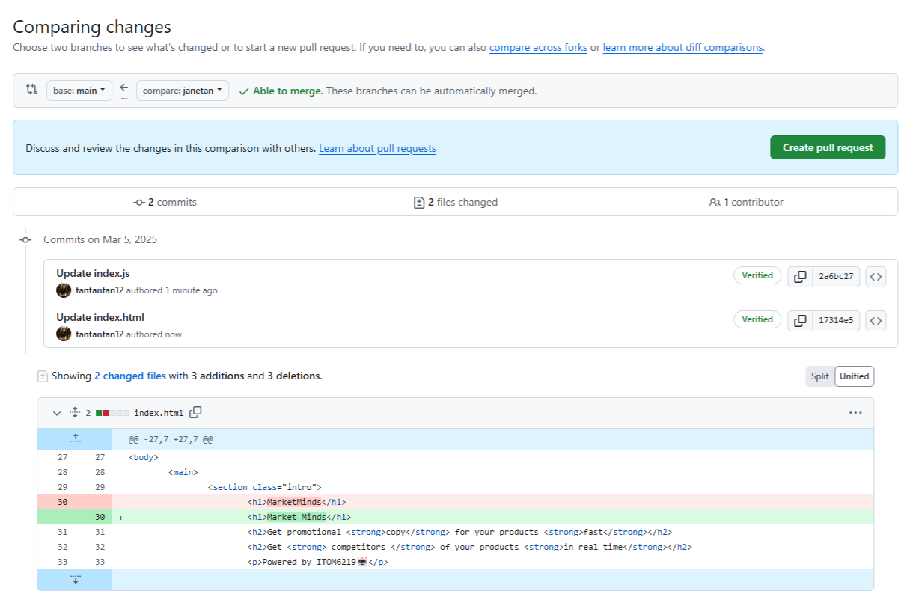
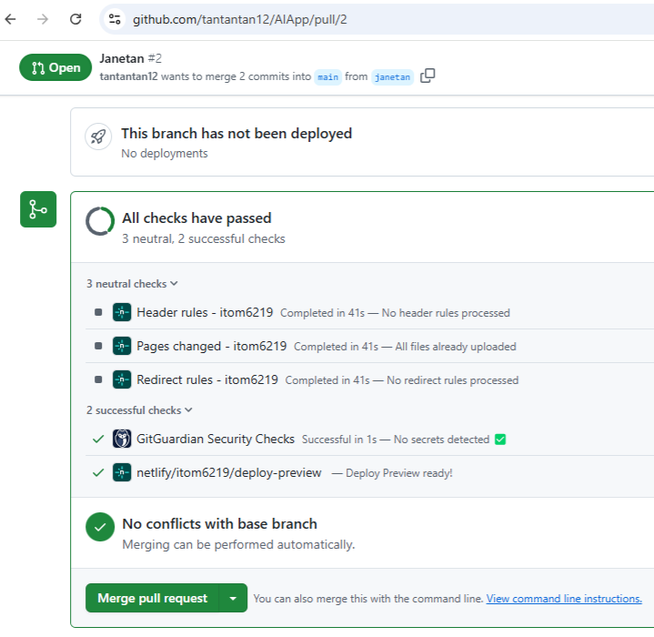

## 1. Welcome 

Welcome to your group AI application template repository!
A repository is a place where you can store your code, your files, and each file's revision history. Repositories can have multiple collaborators and can be either public or private.

Any changes you make here will be reflected in your group project URL: https://itom6219.netlify.app/

## 2. Create Your Own Branch
What if you want to create your own version of the application without affecting the main version? Branches allow you to develop features, fix bugs, or safely experiment with new ideas in a contained area of your repository. You always create a branch from an existing branch. Typically, you might create a new branch from the default branch of your repository.

Click the "Branch" link.



You can generate a branch and name it with your SMU ID. For me, my SMU ID is janetan, and I can create my branch "janetan" that sources from the main branch. 



If my group URL is https://121-group2.netlify.app/, I will be able to visit my own version of the application via this link: https://janetan--121-group2.netlify.app/ (This link does not open because it is hypothetical!)

It is basically the team link with your SMU ID and two hyphens at the beginning. 
To make your application work, you will further need to change index.js in your own branch by adjusting the URLs:

```js

async function fetchReply(){
  const url = 'https://janetan--itom6219.netlify.app/.netlify/functions/fetchAI';

async function fetchCompetitors(productName) {
  const url = 'https:/janetan--/itom6219.netlify.app/.netlify/functions/fetchCompetitors';
```

> In Homework 1, you will be asked to upload the link of your own branch.

## 3. Customize Your AI Application
Students are assigned to different teams, and every team shares one Github repository that has your AI application template in it. Since you are visiting this page, I assume that you already have a GitHub account and were assigned to your group.

When accessing your Github repo, you will see the following file structure:


 
The figure below summarized the function of the major files.


Below is a tutorial about the customization process.


### 3.1 Change the Design (Look) of the Website
The prompt can be changed in the file index.js.

#### 3.1.1 Change the headlines
You can change the headlines by modifying index.html

```html
<section class="intro">
			<h1>MarketMinds</h1>
			<h2>Get promotional <strong>copy</strong> for your products <strong>fast</strong></h2>
			<h2>Get <strong> competitors </strong> of your products <strong>in real time</strong></h2>
			<p>Powered by ITOM6219🤖</p>
		</section>
```

#### 3.1.2 Change the button
If you would like to change the style of the button (or anything else), you should change it in the <code>index.css</code> by adding the following:

```css
button:hover {
      background:#59C3C3;
      transition: 0.7s;
  
  }
```

#### 3.1.3 Change the field label
You can change the input label "Product Name" and the placeholder "Water Bottle". It is important to note that the id for the first input is "name". This will not be shown to your audience but will be used in index.js when generating prompts.
```html
<section class="ad-input" id="ad-input">
			<label for="">Product Name</label>
			<input type="text" placeholder="Water Bottle" id="name">
			<label for="">Description</label>
			<textarea placeholder="Extra big water bottle to cope with the Texas heat" id="desc"></textarea>
			<label for="">Target market</label>
			<textarea placeholder="College students who go to Southern Methodist University" id="target"></textarea>
			<button id="advertising-btn">Generate Copy</button>
			<button id="competitor-btn">Search for Competitors</button>
		</section> 
```

> Did you notice that the two buttons, "Generate Copy" and "Search for Competitors", correspond to different button IDs? The first button has an ID of <code>advertising-btn</code>, and the second button has an ID of <code>competitor-btn</code>.
These IDs will help us distinguish these two buttons in the script <code>index.js</code>.

Our application includes two functions: generating advertising copy and finding competitors by using Google Shopping Search.
When users click the corresponding buttons in the landing page (https://itom6219.netlify.app/), the event listener in <code>index.js</code> for the corresponding button will be triggered to call either <code>fetchAI.js</code> for the advertising copy or <code>fetchCompetitors.js</code> to retrieve the competitors. 


### 3.2 Change the Prompt for Advertising Copy
The prompts are saved in <code>/netlify/fetchAI/fetchAI.js</code> for generating advertising copy.
```js
document.getElementById("submit-btn").addEventListener("click", () => {

  const productName = document.getElementById("name").value;
  const productDesc = document.getElementById("desc").value;
  const productTarget = document.getElementById("target").value;
  prompt += `Use a product name, a product description and a target market to create advertising copy for a product.
  ###
  product name: EcoPure Hydration Bottle
  product description: A sustainable, vacuum-insulated water bottle that keeps drinks cold for 48 hours and hot for 24 hours. 
  product target market: environmentally conscious consumers
  advertising copy: "Stay refreshed and make a difference with the EcoPure Hydration Bottle – the last water bottle you'll ever need. Embrace the power of sustainability with our innovative design, crafted for the eco-warrior in all of us. Whether you're climbing mountains or navigating the urban jungle, keep your drinks ice-cold or steaming hot, all day long. Join the EcoPure movement and quench your thirst for change. #DrinkSustainably #EcoPureAdventure
  ###
  product name: ${productName}
  product description: ${productDesc}
  product target market: ${productTarget}
  advertising copy: 
  `
...
```
### 3.3 Change the Prompt for Competitors Search:
The process for retrieving competitor list is illustrated in <code>/netlify/fetchAI/fetchAI.js</code>.
This script is a serverless function that processes a request containing product information (name, description, and target market) to retrieve and summarize competing products from Google Shopping. It follows three sequential steps that involve OpenAI and SerpAPI (Google Shopping API) to refine, search, and format the competitor results.

- Step 1: Generate a Refined Search Query (OpenAI)
    - Purpose: Ensures the search query is well-structured and optimized for Google Shopping.
    - Why Needed? Raw user input might be vague or inconsistent. OpenAI restructures the query to improve accuracy in retrieving relevant products.
    - How? OpenAI generates a polished search phrase by analyzing product details.
- Step 2: Perform Google Shopping Search (SerpAPI)
    - Purpose: Uses the refined query to fetch relevant product listings from Google Shopping.
    - Why Needed? This step retrieves real-time competitor products that are similar to the user’s input.
    - How? SerpAPI queries Google Shopping and returns a list of related products with details like title, price, and description.
- Step 3: Summarize Competitor Results (OpenAI)
    - Purpose: Extracts the top three most relevant results and formats them into concise bullet points.
    - Why Needed? The API may return excessive or complex data. Summarizing the results provides a clear and user-friendly competitor overview.
    - How? OpenAI takes the top five search results, extracts key details (title, price, truncated description), and then formats the top three into concise bullet points.

```js
const handler = async (event) => {
    try {
        const requestBody = JSON.parse(event.body);
        const { productName, productDesc, targetMarket } = requestBody;

        //  Step 1: Generate a refined search query using OpenAI
        const refineSearch = await openai.completions.create({
            model: "gpt-3.5-turbo-instruct",
            prompt: `Refine this product search query for Google Shopping:\nProduct Name: ${productName}\nDescription: ${productDesc}\nTarget Market: ${targetMarket}`,
            presence_penalty: 0,
            frequency_penalty: 0.3,
            max_tokens: 50,
            temperature: 0
        });

        const refinedQuery = refineSearch.choices[0].text.trim();

        //  Step 2: Perform Google Shopping Search
        const searchResults = await getJson({
            engine: "google_shopping",
            api_key: SERPAPI_KEY,
            q: refinedQuery
        });

        //  Limit results to prevent exceeding OpenAI's 4097 token limit
        const topResults = searchResults["shopping_results"]?.slice(0, 5).map(item => ({
            title: item.title,
//            link: item.link,
            price: item.price,
            description: truncateText(item.description || "", 200) // Truncate descriptions
        })) || [];

        // Step 3: Format search results using OpenAI
        const formattedResponse = await openai.completions.create({
            model: "gpt-3.5-turbo-instruct",
            prompt: `Summarize these Google Shopping search results by listing the title of the top three products in bullet points:\n${JSON.stringify(topResults)}\nLimit it to the top 3 options.`,
            presence_penalty: 0,
            frequency_penalty: 0.3,
            max_tokens: 200,
            temperature: 0
        });

        return {
            statusCode: 200,
        };
    } catch (error) {
        return { statusCode: 500, body: JSON.stringify({ error: error.toString() }) };
    }
};

```

### 3.4 Change the Hyperparameters
The hyperparameters can be changed:

 **Hyperparameter Breakdown**  

| **Hyperparameter**   | **Function** | **Range** | **When to Adjust?** |
|----------------------|-------------|-----------|---------------------|
| **presence_penalty** | Controls the likelihood of the model introducing **new topics**. | `-2.0 to 2.0` | - Increase (>0) if the model is **too repetitive** and you want it to introduce new ideas.<br>- Decrease (<0) if the model **goes off-topic** too much. |
| **frequency_penalty** | Reduces the model’s tendency to **repeat phrases or words** in the response. | `-2.0 to 2.0` | - Increase (>0) if the model is **repeating itself too much**.<br>- Decrease (<0) if the model is **not maintaining key points consistently**. |
| **max_tokens** | Sets the **maximum number of tokens** in the response (1 token ≈ 4 characters). | `1 to 4096` (GPT-3.5-turbo-instruct) | - Increase if responses are **cut off** before completing the output.<br>- Decrease if you need **shorter, faster, and cheaper responses**. |
| **temperature** | Controls **randomness and creativity** in responses. Higher values lead to more variation. | `0.0 to 2.0` | - Increase (>0.7) for **more creative and diverse responses** (e.g., brainstorming, storytelling).<br>- Decrease (0.0 - 0.3) for **precise, factual, and consistent answers**. |


```js

presence_penalty: 0,
frequency_penalty: 0.3,
max_tokens: 100,
temperature: 0,
 

```
**Current Settings and Recommendations**

| **Current Setting**        | **Effect**                                           | **Potential Adjustments** |
|----------------------------|------------------------------------------------------|---------------------------|
| **presence_penalty: 0**    | No encouragement to introduce new topics, keeping responses focused. | - Increase if the responses feel too **predictable**.<br>- Keep at `0` for factual tasks like summarization. |
| **frequency_penalty: 0.3** | Slightly reduces repetition, but still allows key phrases to be reinforced. | - Increase (`0.5-1.0`) if repetition remains an issue.<br>- Lower (`<0.3`) if responses seem **incomplete or inconsistent**. |
| **max_tokens: 100**        | Limits response length to **about 1-2 sentences**. | - Increase (`150-200`) if responses **cut off too early**.<br>- Keep low (`50-80`) for short **ad copy or bullet-point lists**. |
| **temperature: 0**         | Makes responses **deterministic** (same output for the same prompt). | - Increase (`0.5-0.7`) if responses feel **too robotic** or lack creativity.<br>- Keep at `0` for structured tasks like **query refinement or summarization**. |

## 4. Merge Your Branch into Main
You can visit your branch through https://janetan--itom6219.netlify.app/. If this version is approved by your team, you can further merge it to the main and visit it through https://itom6219.netlify.app/.

**Step1** : Go to the "Pull requests" tab. 

 


**Step 2** : Then, create a "New pull request" by comparing and reviewing the base:main with the compare:janetan branch. 

 


**Step 3** : After creating a pull request, comparing and reviewing will be done, before you can confirm the "Merge pull request" to merge commits of this branch to main.

 


**Step 4** : Make sure to change the URLs back by removing your branch name and hyphens.
